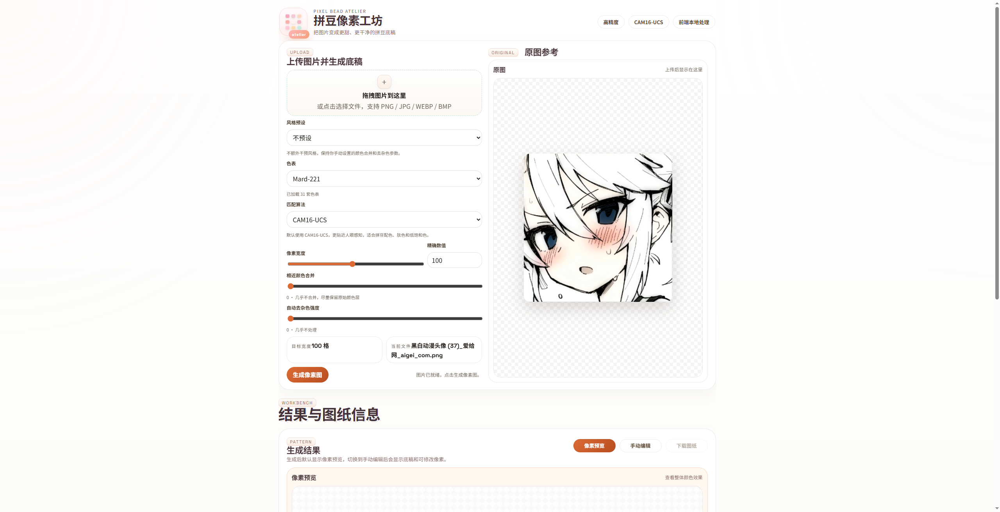
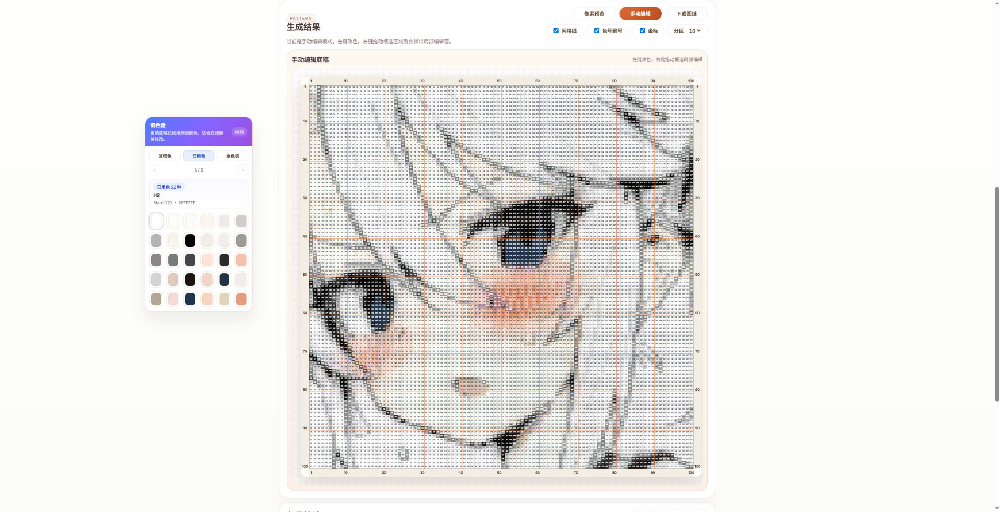

# 拼豆底稿工坊

一个基于 `Vite + TypeScript` 的前端拼豆底稿工具。

它可以把图片转换成更适合拼豆制作的像素图，并支持色号映射、手动编辑、局部放大、去杂色和图纸导出。

## 项目预览

### 上传与生成



### 手动编辑



## 功能概览

- 上传图片并生成拼豆像素图
- 支持 `Mard-221` 等色表映射，色号数据来自 `colorMap.json`
- 支持两种颜色匹配算法
  - `CAM16-UCS`
  - `CIEDE2000`
- 支持风格预设
  - 不预设
  - 平均
  - 真实
  - 动漫
  - 人物
- 支持相近颜色合并与自动去杂色
- 支持手动编辑像素、取色、框选局部编辑
- 支持导出拼豆图纸 PNG
- 已针对手机端做基础适配与触屏编辑优化

## 技术栈

- `Vite`
- `TypeScript`
- `Canvas 2D`
- `Web Worker`
- `colorjs.io`

## 本地开发

安装依赖：

```bash
npm install
```

启动开发环境：

```bash
npm run dev
```

构建生产版本：

```bash
npm run build
```

本地预览构建结果：

```bash
npm run preview
```

## 手机访问本地网页

如果你想用手机访问本地运行的页面，可以这样启动：

```bash
npm run dev -- --host 0.0.0.0 --port 5173
```

然后确保手机和电脑连接到同一个局域网，再在手机浏览器中访问：

```text
http://你的局域网IP:5173
```

例如：

```text
http://192.168.1.3:5173
```

## 项目结构

```text
src/
  main.ts          页面结构、交互逻辑、画布渲染、导出
  pixelWorker.ts   像素化、颜色匹配、合并与去杂色计算
  style.css        页面样式与响应式布局
images/            README 预览图片
colorMap.json      色号数据
```

## 当前匹配算法

当前默认使用 `CAM16-UCS`，因为它在拼豆配色、肤色、低饱和色等场景下更贴近人眼感知。

你也可以手动切换到 `CIEDE2000` 做结果对比。

## 说明

- 这个项目当前是前端本地处理，不依赖后端服务
- 图片处理和颜色匹配主要在 `Web Worker` 中执行，避免阻塞界面
- 对于超大尺寸底稿，手机端编辑体验仍建议优先用局部编辑窗完成精修
